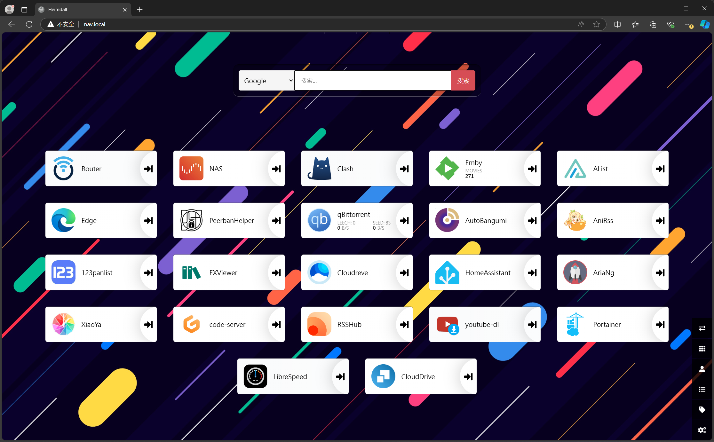

如果你和我一样，内网部署了一堆应用，但是又经常懒得再从导航页跳转

那么你可以通过.local域名来访问你的网页应用。

使用到的工具：nginx，dnsmasq，openwrt

## 原理部分

通过在路由器上使用自自定义host文件，实现使用自定义域名访问```http://[IP]:80```。

使用nginx反向代理应用网页，仅在80端口提供服务并通过域名区分反向代理服务器。

## 配置部分

访问路由器后台 “网络 > DHCP/DNS > HOST和解析文件”

点击 “添加额外的HOSTS文件”

host文件示例：
```host
192.168.3.1 router.local
192.168.3.3 nas.local
192.168.3.3 nav.local
192.168.3.3 alist.nas.local
192.168.3.3 portainer.nas.local
192.168.3.3 qbittorrent.nas.local
192.168.3.3 librespeed.nas.local
```

将对应的域名解析到部署了nginx的机器上。

可以全用软路由，但我选择分开，每个机器只反向代理自己的服务。

:::important[重要提示]
将原本部署在80端口的修改为非80端口，否则nginx将启动失败。
:::

:::tip[重启Dnsmasq]
```shell
/etc/init.d/dnsmasq restart 
```
:::

nginx添加对应的配置，模版如下：
```nginx
server {
    listen 80;#端口80无需修改
    server_name librespeed.nas.local;#这里修改为对应的域名
    location / {
        proxy_pass http://localhost:8005;#这里是对应服务的地址
        proxy_set_header Upgrade $http_upgrade;
        proxy_set_header Connection $connection_upgrade;
        proxy_set_header Host $host:$server_port;
        proxy_set_header X-Real-IP $remote_addr;
        proxy_set_header X-Forwarded-For $proxy_add_x_forwarded_for;
        proxy_set_header X-Forwarded-Host $host;
        proxy_redirect http:// $scheme://;
    }
}
```

从此域名直达，再也不用记端口 ✌️

在异地组网的情况下依然适用，只需要在电脑或者路由器上有对应的host条目即可。 ~~其实是我整不明白DNS~~

在这里放一个适用于unraid的自动创建配置文件并应用的脚本供参考：[make.nas.local.py](https://gist.github.com/RiderLty/9b982367ad7c0f682a01eafd1ecdce7e)

## 安卓用户注意！

在使用过程中发现了一个奇怪的问题，我的所有设备，MAC，ipad，PC等等都可以正常使用本地域名，但是安卓手机却有一定概率会出现DNS_PROBE_FINISHED_NXDOMAIN 错误。

后来了解到是手机内置了DNS，导致没有使用路由器的解析。整个一个大无语。

[小米9故意内置隐藏的114DNS污染了路由器海外DNS解析结果 #712
](https://github.com/pymumu/smartdns/issues/712)

解决方案是劫持所有DNS请求都转发到自己：
```
iptables -t nat -A PREROUTING -p udp --dport 53 -j REDIRECT --to-ports 53
iptables -t nat -A PREROUTING -p tcp --dport 53 -j REDIRECT --to-ports 53
```