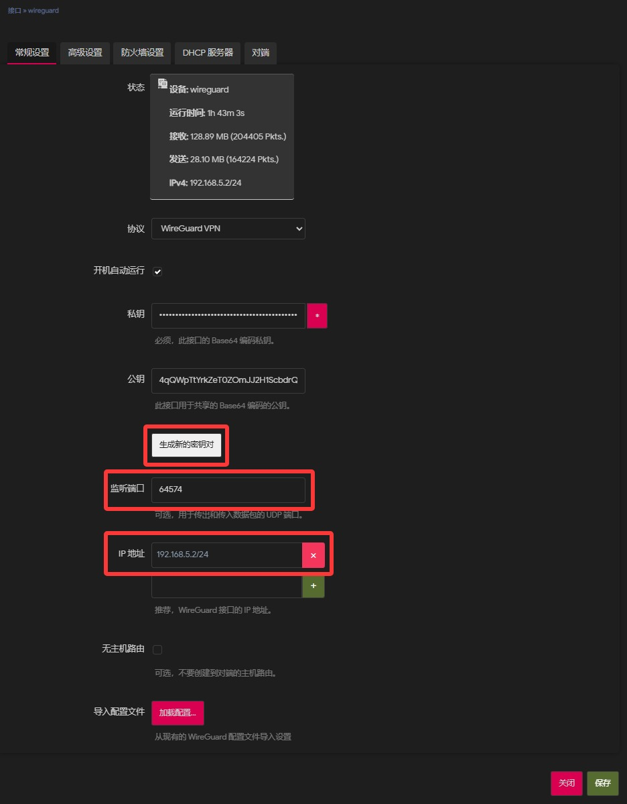
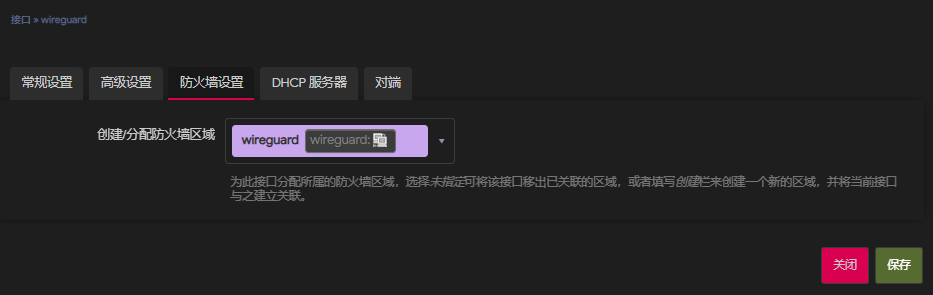
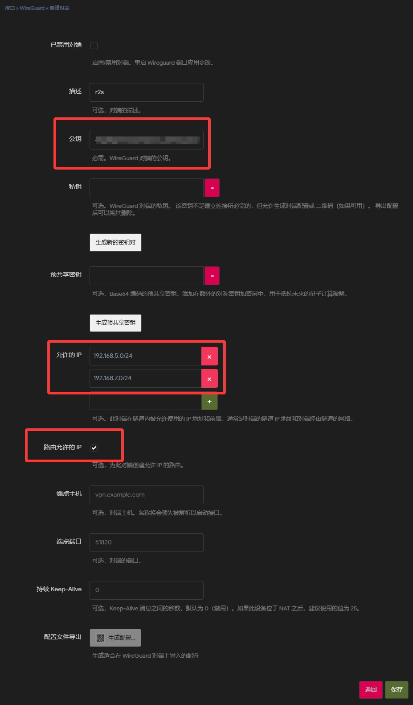
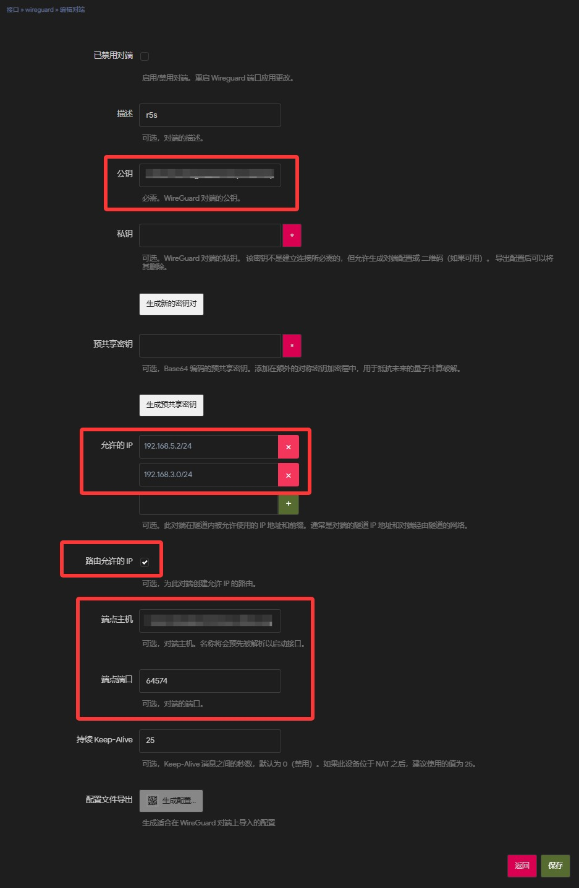
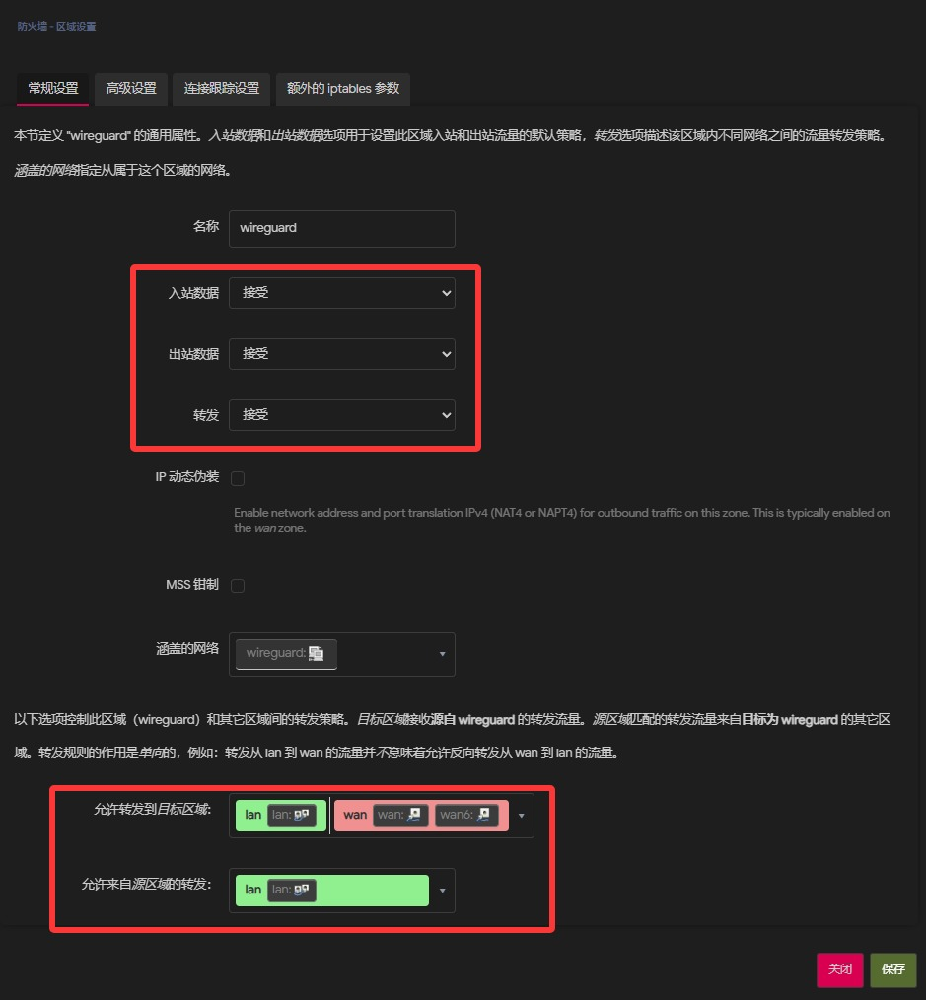

[wireguard](https://www.wireguard.com/)是一个高性能、极简且易于配置的开源虚拟组网协议。

tailscale的底层协议正是wireguard，但是由于tailscale可配置的功能有限再加上最近tailscale一直抽风，网络明明是通的，但是却一直无法直连。

于是转而投向更加底层、性能更好的wireguard。（大概15ms=>8ms）

本文讲介绍如何在两台openwrt上安装wireguard并实现异地组网，同时保留tailscale的访问功能。

# 设备环境

路由器A 192.168.3.1/24

具有公网ip6同时配置了DDNS可使用域名访问，开放了wireguard端口。

路由器B 192.168.7.1/24

具有ipv6但是由于防火墙限制，无法直接被外部访问。所以还需要保留tailscale，以供移动设备直连。

# 预先准备

## 建议步骤

本次在路由器B的局域网下操作，首先要保证A的可访问性。最简单的是直接安装Edge-Docker，并将端口临时映射到公网，以供在虚拟网络断开期间访问A路由器。

:::warning[网络安全]
临时映射端口到公网仅用于临时调试，正式使用时应关闭该映射。

绝对不要将任何未加密或者无任何认证的服务映射到公网。
:::

## tailscale设置

首先不再接受子网路由，否则会与wireguard冲突。

如果两台路由器可以使用wireguard互联并ping通，且能访问对方的局域网设备。

但是两台路由器下的设备无法访问对方的局域网设备，这是tailscale的路由功能导致的。

```shell
tailscale up --accept-routes=false --advertise-exit-node --advertise-routes=192.168.3.0/24
```

```--accept-routes=false``` 不再接受其他节点通告的子网路由。

# 配置wireguard

## 安装

```shell
opkg update && opkg install luci-proto-wireguard qrencode
```
qrencode 用来显示wireguard的配置文件，方便在移动设备上配置。本文没有使用，可以跳过。

安装完成后重启路由器。

## 配置接口


网络 > 接口 > 添加新接口

协议选择 WireGuard VPN



生成新的密钥，并记录下公钥。用于在其他设备上认证此设备。

监听端口，wireguard用来通信的端口，需要能在公网访问到，记得打开防火墙。

ip地址，如```192.168.5.1/24```另一台```192.168.5.2/24```，组网的虚拟网段为```192.168.5.0/24```。



防火墙设置，创建一个新的区域wireguard

两台路由器上配置到现在为止都是一样的，只是虚拟局域网的ip地址不同。



在路由器A上，添加对端以允许B连接。

公钥填写路由器B的公钥。

允许的IP填写虚拟网段```192.168.5.0/24```和B的局域网网段```192.168.7.0/24```

勾选路由允许的IP，以自动创建路由规则。



在路由器B上，添加对端以连接到A。

公钥填写路由器A的公钥。

允许的IP填写虚拟网段```192.168.5.0/24```和A的局域网网段```192.168.3.0/24```

勾选路由允许的IP，以自动创建路由规则。

端点主机填写路由器A的域名。

端点端口填写A的wireguard通信端口。

保存并应用后，重启端口，使配置生效。

## 配置防火墙

网络 > 防火墙 > 添加



入站数据、出站数据、转发数据 全部接受

允许转发到目标区域 lan和wan

允许来自源区域的转发 lan

保存并应用

此时两台路由器下的设备应该都可以通过虚拟局域网ip访问两台路由器，且能直接通过局域网IP访问对方的设备。

如果在路由器上能ping通虚拟局域网和对方局域网的设备，但是本路由器下的设备无法ping通，检查tailscale是否设置了```--accept-routes=false```

有时候重启路由器后，需要手动在路由器上重新运行tailscale up命令，并设置```--accept-routes=false```

:::warning
记得关闭Edge-Docker的端口映射
:::