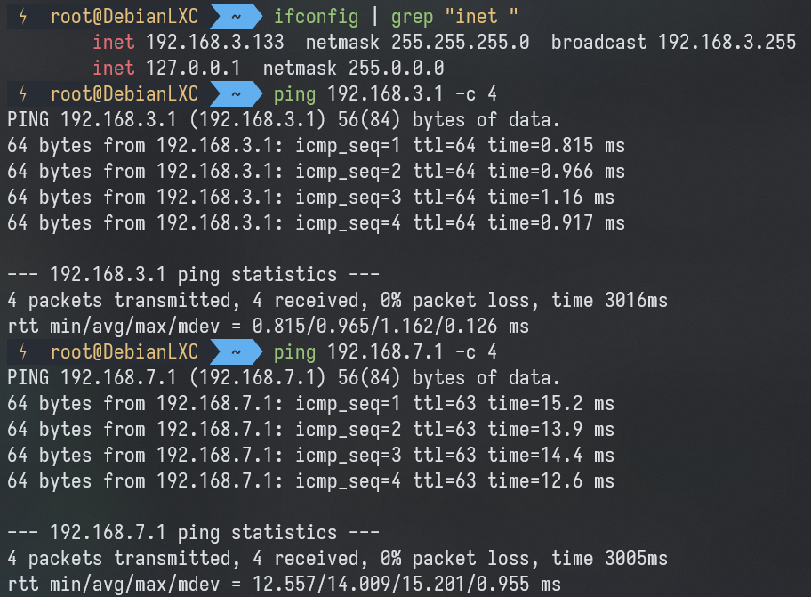

::github{repo="tailscale/tailscale"}

[tailscale](https://tailscale.com/) 可以很方便搭建起一个虚拟局域网，但是需要每台机器都安装tailscale，且需要使用虚拟局域网的IP才能互相访问。

特别是安卓，无法在wifi下获取IPV6，只能用移动数据才能直连。

本文讨论通过软路由实现无感的异地组网，实现多个不同局域网下的设备无需安装tailscale直接使用内网IP跨网段互相访问。

:::note[注意事项]
tailscale是一款处于更新中的软件，本文写于2024-10-18

路由器为 iStoreOS 22.03.5 2023121510，tailscale版本为1.32.3-1 (OpenWrt)
:::

修改路由器的LAN网段，确保不冲突，如：192.168.3.0/24 ; 192.168.7.0/24。

分别在每台路由器上安装tailscale：
```shell 
opkg update && opkg install tailscale
```

使用如下命令，开启tailscale并登录。
```shell
tailscale up --accept-routes --advertise-exit-node --advertise-routes=192.168.3.0/24
```

其中```--accept-routes```表示接受作为子网路由器的节点的通告路由。

将```--advertise-routes=192.168.3.0/24```中通告的网段换为本路由器的LAN网段。

在所有路由器上操作后，在路由器下的设备即可通过内网IP直接访问不同网段的局域网设备。

```--advertise-exit-node```为开启

