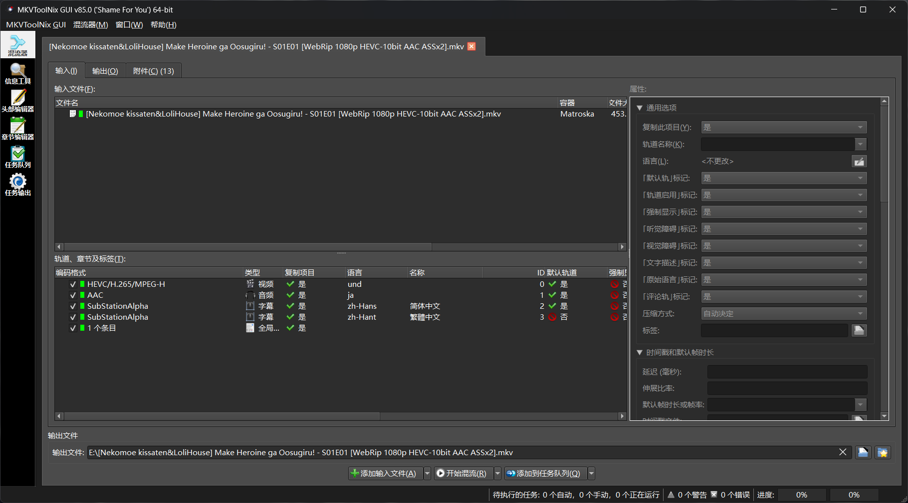
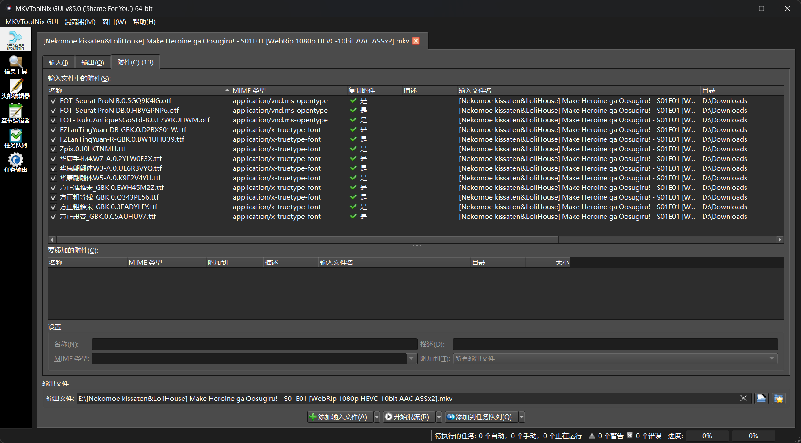

Emby本质只是一个媒体服务器而不是播放器，所以视频还是在用本地播放器播放。
如果视频的字幕里用到了系统未安装的字体，则会调用默认字体来显示。

曾经我也是下载了Fonts.7z就直接删除的，直到遇见了一些番剧字幕显示明显不对才意识到可能是字体到的问题。

目前最好的解决方案是将字幕和字体都封入MKV容器，例如喵萌奶茶屋&LoliHouse的《败犬女主太多了！》：





但是我的网盘里还有几百部番剧，一部一部下载下来嵌入字体上传回去工作量实在太大了。

就在我搜寻解决办法之时，看到了mikusa大佬的[我的动画字幕字体解决方案](https://www.himiku.com/archives/my-solution-for-perfect-anime-subtitle-fonts.html)才知道原来还可以在ass字幕中嵌入字体，同时也了解到了wyzdwdz大佬的[assfonts: 字体文件子集化工具，提供嵌入字幕功能](https://bbs.acgrip.com/thread-9897-1-1.html)。

最初的打算是将所有的ass文件都替换为嵌入字体的ass，但是这样工作量其实也不小。

于是结合之前做的nginx直链的思路，🤓☝️唉！不如我们用nginx代理字幕文件的接口，客户端请求的时候再对字幕进行字体嵌入然后替换原本内容返回给客户端。连字幕文件都不需要手动处理，简直懒人福音耶。

于是这个项目诞生了：

::github{repo="RiderLty/fontinass"}

## 原理部分

* 将字体子集化后，使用uuencode编码为文本并嵌入字幕。

* nginx拦截字幕请求，将嵌入了字体的字幕返回给客户端。

## 实现过程

使用nginx将```/videos/(.*)/Subtitles```的字幕请求发送至python搭建的http服务器处理。
```nginx
location ~* /videos/(.*)/Subtitles {
    proxy_pass http://127.0.0.1:8011;
}
```

python程序根据url先去请求原始字幕文件，然后进行字体的子集化与嵌入。将处理后的字幕文件返回给客户端。

```python
@app.get("/{path:path}")
async def proxy_pass(request: Request, response: Response):
    try:
        host = os.environ.get("EMBY_SERVER_URL") or EMBY_SERVER_URL
        url = (
            f"{request.url.path}?{request.url.query}"
            if request.url.query
            else request.url.path
        )
        embyRequestUrl = host + url
        logger.info(f"字幕URL:{embyRequestUrl}")
        serverResponse = requests.get(url=embyRequestUrl, headers=request.headers)
        copyHeaders = {key: str(value) for key, value in response.headers.items()}
    except Exception as e:
        info = f"fontinass获取原始字幕出错:{str(e)}"
        logger.error(info)
        return info
    try:
        logger.info(f"原始大小:{len(serverResponse.content)}")
        srt, bytes = process(serverResponse.content)
        logger.info(f"处理后大小:{len(bytes)}")
        copyHeaders["Content-Length"] = str(len(bytes))
        if srt:
            if (
                "user-agent" in request.headers
                and "infuse" in request.headers["user-agent"].lower()
            ):
                raise ValueError("infuse客户端，无法使用SRT转ASS功能，返回原始字幕")
        return Response(content=bytes)
    except Exception as e:
        logger.error(f"处理出错，返回原始内容 : \n{traceback.format_exc()}")
        return Response(content=serverResponse.content)
```

## 部署

见github：[快速开始](https://github.com/RiderLty/fontinass?tab=readme-ov-file#%E5%BF%AB%E9%80%9F%E5%BC%80%E5%A7%8B)

<iframe width="100%" height="337"src="//player.bilibili.com/player.html?isOutside=true&aid=112988526742369&bvid=BV1e1p2eMEVP&cid=500001654840948&p=1" scrolling="no" border="0" frameborder="no" framespacing="0" allowfullscreen="true"></iframe>


## PS

已将VCB的[超级字体整合包 XZ ](https://vcb-s.com/archives/1114)上传CDN，程序会直接联网获取，所以即使本地没有字体也可以应对大多数字幕。